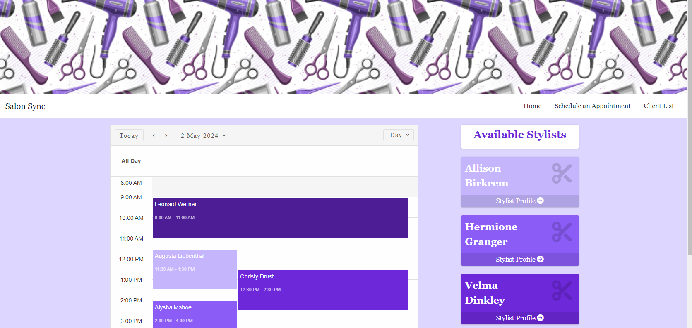
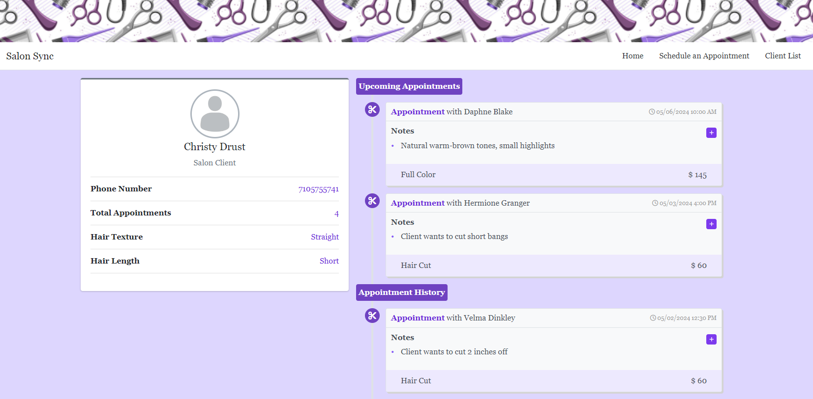

# Salon Sync

## Table of Contents

- [Description](#description)
- [Features](#features)
- [Usage](#usage)
- [Credits](#credits)

## Description

Salon Sync is an ASP.Net Core MVC Framework web application that showcases full stack development by seamlessly integrating front-end, back-end, and database technologies to create a comprehensive salon management solution. Through its user-friendly interface, built with HTML, CSS, and JavaScript, salon owners and stylists can easily interact with the application, create appointments, view client preferences, and stay up to date with upcoming schedules.  

### Technologies
The application's database, powered by cloud-based technologies such as Firebase, stores critical salon information securely, including client profiles, appointment schedules, and stylist information. By leveraging the power of full stack development, Salon Sync ensures data integrity, scalability, and reliability.  

Overall, Salon Sync exemplifies the synergy between front-end, back-end, and database technologies, offering a complete salon management solution that is intuitive, efficient, and adaptable.  

### Purpose
Salon Sync was developed as a portfolio project to demonstrate my full stack development skills and address the need for a salon management solution. Through this project, I deepened my understanding of MVC frameworks and crafted an intuitive user interface. Salon Sync challenged me to handle various aspects of software development, from database design to seamless integration of technologies. It reflects my commitment to creating practical solutions that prioritize usability and efficiency.

## Features
- **Effortless Scheduling:** Easily schedule appointments with available time slots displayed to avoid overlaps.
- **Interactive Calendar:** View the schedule for today and the upcoming month's appointments on the homepage calendar.
- **Stylist Profiles:** Create and manage stylist profiles, including personal information, specialties, and availability.
- **Comprehensive Client Records:** Access detailed client records to provide personalized service and track appointment history.
- **Reporting and Analytics:** Track key metrics such as appointment trends, client retention rates, and stylist performance to gain valuable insights for salon management.
  
## Usage

### Pages  

#### Index  
- The opening page features a calendar displaying all of today's appointments as well as the stylists they are with.

  
*Actions*
- Browse the calendar to view tomorrow's, yesterday's, or next week's appointments etc.
- Click the Stylist Profile button below each stylist's profile page

#### Stylist Profile 
- Profile page containing the stylist's name, experience, location, and specialties. The appointments are separated by upcoming appointments and past appointments.

  
*Actions*
- View profile information for this stylist.
- View all appointments for this stylist.

#### Schedule an Appointment
- On this page you can schedule an appointment for an existing or new client up to one month in advance. Appointment availability for the selected hair stylist and date will be displayed to the user during the Time Selection pane. (Clients are considered unique by their phone numbers)

  
*Actions*
- Schedule an appointment for a new client
- Schedule an appointment for an existing client
- Test form validation  

#### Client List  
- Simple page containing a table of all of the salon's clients. It can be used to easily find a client's profile.

  
*Actions*
- Click into a client profile, easily find a client's phone number.  

#### Client Profile 
- Profile page containing the client's name, phone number, hair texture & length, and information on all of their appointments with the salon. The appointments are separated by upcoming appointments and past appointments. This page also allows for the user to add notes to each appointment.

  
*Actions*
- View client demographics.
- View all appointments for this client.
- Add notes to an appointment by clicking the plus icon.  

## Credits

| Assets    | Links to Documentation | Usage |
| -------- | ------- | -------|
| smart-scheduler  | [HTML Elements](https://www.htmlelements.com/)   |  Calendar element used on index screen for displaying existing appointments |
